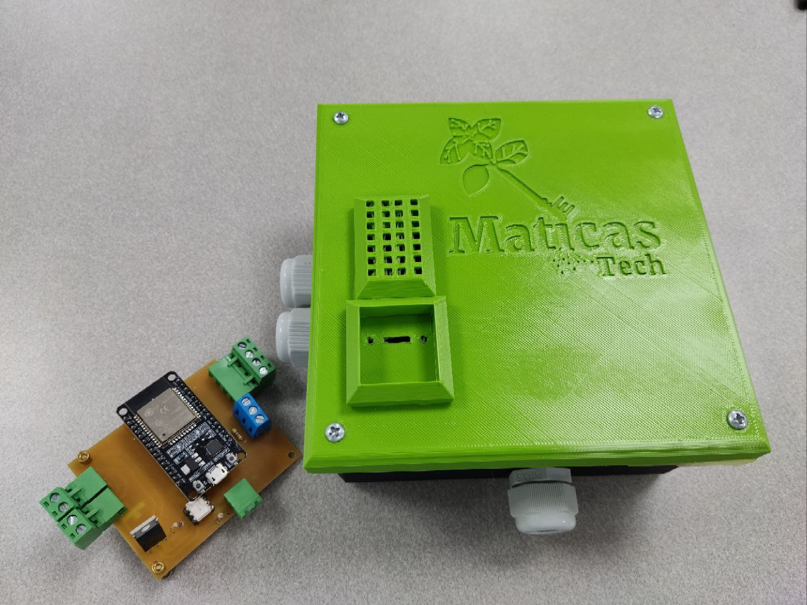

# Maticas Kratky System 🌱

In this project we built a modified kratky system which consists of the usual bucket but now incorporates additional oxigenation with an oxigen pump, the idea behind this was to test the results of adding micorrizae to the water and keep it alive inside the kratky system with this additional aeration, comparisson tests still remain to be done yet, however we've got good results with our basil crop test.

## Key features

- Capacity up to 8 plants with the current architecture for the growing system. 
- Measure ambient variables such as relative humidity and temperature, allows for extension and triggering of actions with this measurements.
- Control an AC actuator such as an oxigen pump _(We are expanding in order to control up to 3 AC actuators)._

- Local web server to monitor the conditions in the last 3 hours of operations of the device.
- Local web server available for modifying the periodicity and way the actuator works.
- Screen to display IP of the device in the local network and other desired data. 

## Notes over the development 📝

## Needed materials for replication ✅
### Structural materials

1. A pair of 20 liter containers [link to example product](https://articulo.mercadolibre.com.co/MCO-861436425-set-x-10-balde-cunete-20-litros-_JM#position=3&search_layout=stack&type=item&tracking_id=a9eae8bf-e021-4639-ab13-fa13d58bef19).

2. 8 cultivation baskets (or less depending on the space your plant needs) [link to reference product](https://www.amazon.com/Hydroponic-Plastic-Cultivation-Planting-Gardening/dp/B08R8LMF6L/ref=sr_1_2?crid=33OS09TYPPLFV&dib=eyJ2IjoiMSJ9.NfalgvycNBMZZM1CF_ESWtjJ-_G-A7rY25RSB5krQUKKu4zvjQOSep1QU8vNXbIBJZi8SxxX1UX_PGTqu9Y3c_O0HlxBX3RvG88J899UqGv6HMJnEB2_HnzHph0q5utguDc6kE3GUgI9agA3PfEJ_iiaWEtEIZAs9WypR67XA2uo8wHGvai6LVUqicH2mOItq_8Ez5xifLfuTdL25kr9XqGLHVQyb09th7wc6r4y1ZBvvjbuNm3003uHhowcbKyp5Qu8dFGKMpfdHdC23SAWrEkK7mI-vT8sbuXWG8rCJaw.tj7JQEGJlyXKRcYd60H6Gh8BUas8VBsp5r49KVKrqL0&dib_tag=se&keywords=cultivation%2Bbaskets&qid=1711304922&sprefix=cultivation%2Bbaskets%2B%2Caps%2C162&sr=8-2&th=1).

3. Air pump [example pump](https://articulo.mercadolibre.com.co/MCO-828833010-motor-acuario-bomba-aire-oxigenador-pecera-sin-ruido-acuario-_JM#is_advertising=true&position=1&search_layout=stack&type=pad&tracking_id=4d639074-c1e2-48ae-9c66-dc5a935c168f&is_advertising=true&ad_domain=VQCATCORE_LST&ad_position=1&ad_click_id=MjVmMDlmNWUtZmMyNC00NzI5LTg3YzItYTk3ZTJmMmUyZjk0).

4. Aquarium air stone diffusers [example diffuser](https://www.amazon.com/Aquarium-Cylinder-Accessories-Aquariums-Hydroponics/dp/B0B5R4DPP4/ref=sr_1_1?crid=1SMPKYZOVELAB&dib=eyJ2IjoiMSJ9.bYox5_LtqWn6su9Wdz4MGksotg5drfPjVbRpfjfV-7IkkrKw_FJmMDLzeYbfXDuNSDt3veWC0XFa6AAccKDn4vQ9qUUU_1QssylXTpPmLcpmMjAbBRaPriJj0xX9hwzNj1CgQbNfhM-tdzv_dWbigJumpz4xnGMrJDGax5xlCFdexQzCXAT5YXj7lvunnvkJHUjLtX1joVtqP0F6c_U1M5tq5ApRwxZfF3eH2JOzDfbZmkIhMfIV7i76dDQLvMg87O9z_dMmFcrkJMMKWhZCCJYrFKIK8w6_JuF3CszubyE.QtLIYJUgAqKs_8v_JvBkuVRv9JHkySblDV2VH8DHTeQ&dib_tag=se&keywords=piedra+difusora+de+ox%C3%ADgeno&qid=1711305222&sprefix=piedra+difusora+de+oxigeno%2Caps%2C150&sr=8-1).

5. 4 mt of silicone tube for air transportation a package like [this one](https://www.amazon.com/Airline-Tubing-Stones-Control-Connectors/dp/B0858ZSP7K/ref=sr_1_3_sspa?crid=3TNESZ93WISKB&dib=eyJ2IjoiMSJ9.sovKH5NJyHOsVmWs2hz6Ht_xFCxORp2X05G5TDa6q2JQL-1VMc0XH-OhBPIdIPjZ2DMqbKdpTYkqdIbC02VWXG6vzabmX_h4eCJGbAI5AEbuA0WyAUsYs2vwRpNiP3D_Uj2Xd3s59SmZShHrKvqzM49QpDzE4bv0fL98o1GpvlKIro7D_Pzl-cutH3pGB4XjRDQpezad1O4Es-3m8iUo_O30XGFjgO5_aJhEMZxsqeP4P3fVncNYsYNqrbthmLjemEVkY4FUC9LfnoOSpl9v1yswrIK7IoVrgauFSmWxGwA.nyoMq-X0ltysEeeU2XZvxWpWu1KCDNhN9zuVRrFSeos&dib_tag=se&keywords=silicone+aquarium+air+tubing&qid=1711305793&sprefix=aquarium+silicone+tub%2Caps%2C180&sr=8-3-spons&sp_csd=d2lkZ2V0TmFtZT1zcF9hdGY&psc=1) can be really usefull because contains most of the elements we would need to use like:
- 1 check valve.
- 1 T shape conector for airline tubing. 

### Hardware materials

1. ESP32 module as there are many providers of ESP32 modules and they sometimes change the distribution of the pins I would recommend buying first the ESP32 and then checking if the PCB files we have need some previous small adaptation to fit the ESP32 module you got.
2. DHT11 or DHT22 _(you tecnically can use any sensor you want)_ feel free to modify the code if needed.
3. 10 kohm resistor for the DHT11 sensor as a pull up. 

## Contributing and TODOs 🔨💻

## Donate 💸

## Acknowledgments 🤝🫂

Thanks a lot to Sergio Colmenares _(our expert in electronic engineering)_ for the testing, development and support with the electronics of this project along with the 3D box design for the protection of the electronics, without you this truly could not have been possible. The ideas and dedication you brought are amazing and hope to continue with this parthership :D.

_this box by Sergio will be available soon in this repository_.

And last but not least at all thanks to Universidad del Rosario, particularly to the EICT team Nicolás Castiblanco, Katherine Escamilla, Julian for providing help on the ideation, PCB manufacturing and soldering, debugging, materials, good conversation and all the good times shared on the process you are great friends and support <3.      
Thanks to Rafael Mendez our Dean for facilitating all the space for constructing the project, the resources, trust and visibility that keeps us connecting with the right people and ideas, you are an example for us we want to follow <3.

