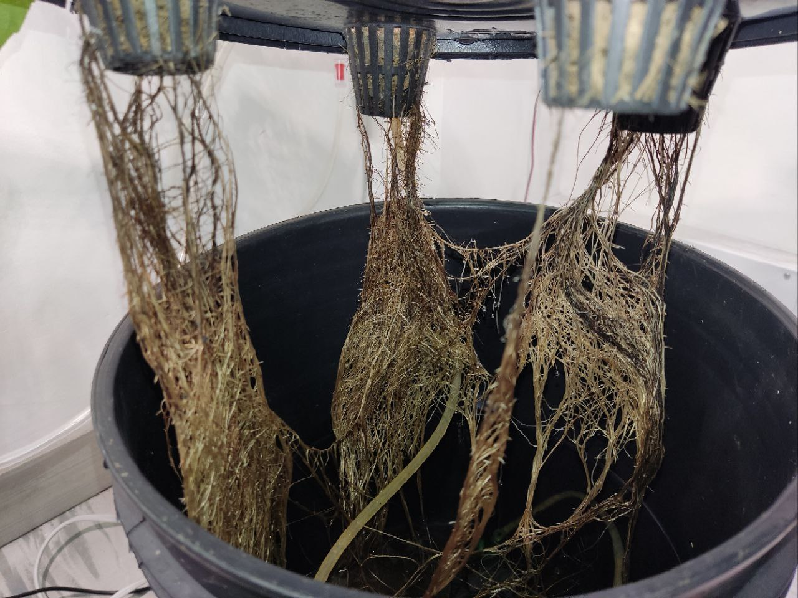
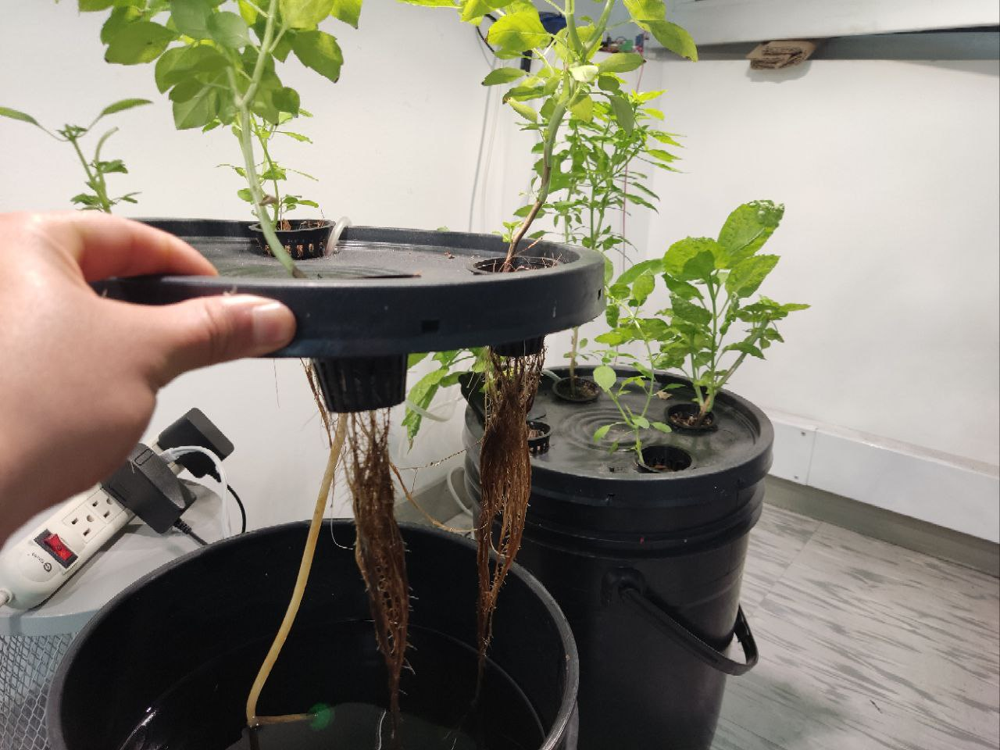
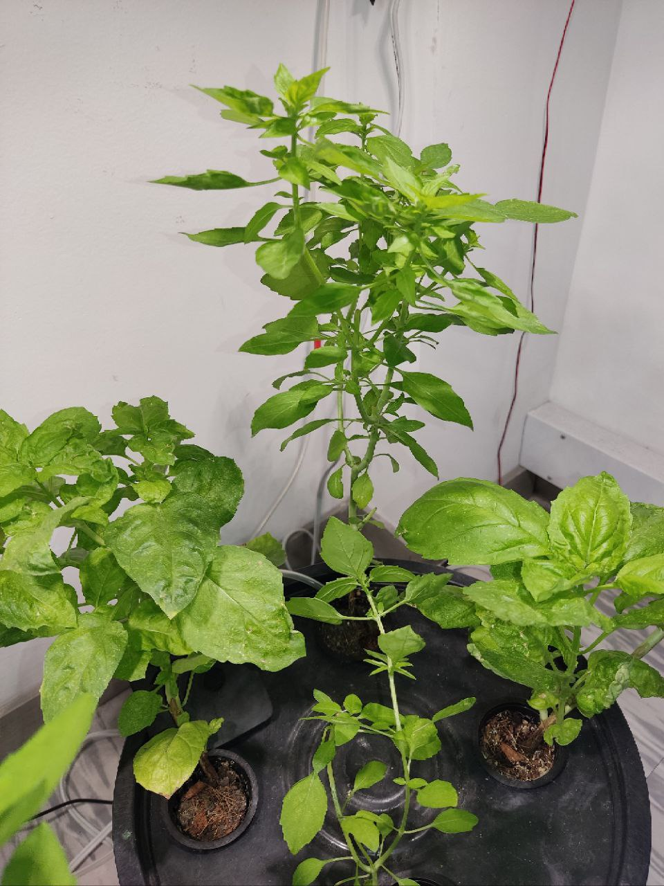
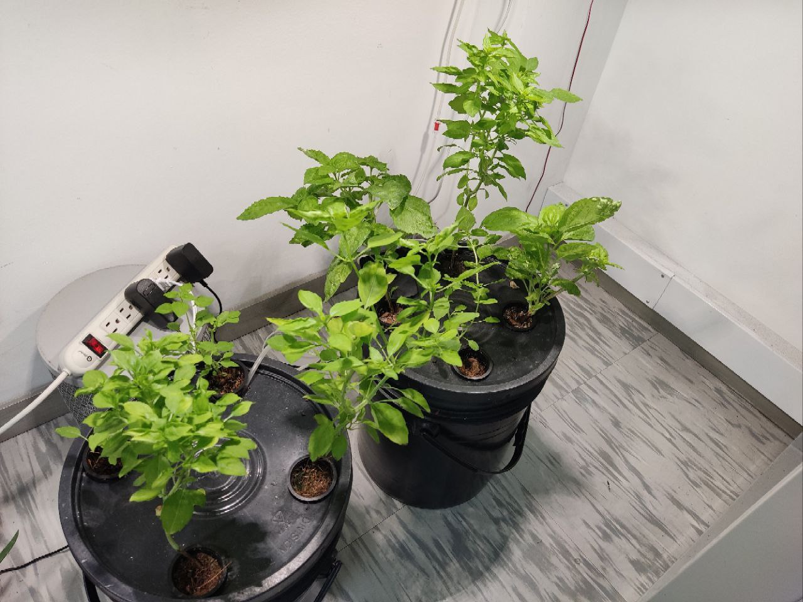
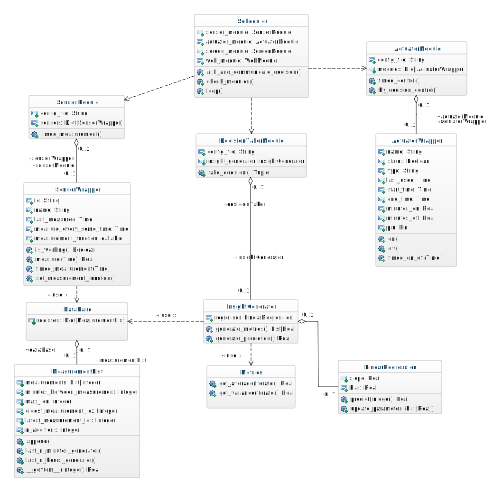

# Maticas Kratky System 🌱

In this project we built a modified kratky system which consists of the usual bucket but now incorporates additional oxigenation with an oxigen pump, the idea behind this was to test the results of adding micorrizae to the water and keep it alive inside the kratky system with this additional aeration, comparisson tests still remain to be done yet, however we've got good results with our basil crop test.

### Results of the basil growing test

All the plants are showing a good root development.

And so far we've done 10 prunnings in about 2 months. It's true that we now have to develop a better concise and clear way to measure and compare results, but as far as building a system which allows plants to live with out concerning too much about taking care of the plants (5hr/month maximum) we've achived good results.

## Key features

- Capacity up to 8 plants with the current architecture for the growing system. 
- Measure ambient variables such as relative humidity and temperature, allows for extension and triggering of actions with this measurements.
- Control an AC actuator such as an oxigen pump _(We are expanding in order to control up to 3 AC actuators)._

- Local web server to monitor the conditions in the last 3 hours of operations of the device.
- Local web server available for modifying the periodicity and way the actuator works.
- Screen to display IP of the device in the local network and other desired data. 

  

    
  

  

    
  

## Notes over the development 📝

## Needed materials for replication ✅
### Structural materials

1. A pair of 20 liter containers [link to example product](https://articulo.mercadolibre.com.co/MCO-861436425-set-x-10-balde-cunete-20-litros-_JM#position=3&search_layout=stack&type=item&tracking_id=a9eae8bf-e021-4639-ab13-fa13d58bef19).

2. 8 cultivation baskets (or less depending on the space your plant needs) [link to reference product](https://www.amazon.com/Hydroponic-Plastic-Cultivation-Planting-Gardening/dp/B08R8LMF6L/ref=sr_1_2?crid=33OS09TYPPLFV&dib=eyJ2IjoiMSJ9.NfalgvycNBMZZM1CF_ESWtjJ-_G-A7rY25RSB5krQUKKu4zvjQOSep1QU8vNXbIBJZi8SxxX1UX_PGTqu9Y3c_O0HlxBX3RvG88J899UqGv6HMJnEB2_HnzHph0q5utguDc6kE3GUgI9agA3PfEJ_iiaWEtEIZAs9WypR67XA2uo8wHGvai6LVUqicH2mOItq_8Ez5xifLfuTdL25kr9XqGLHVQyb09th7wc6r4y1ZBvvjbuNm3003uHhowcbKyp5Qu8dFGKMpfdHdC23SAWrEkK7mI-vT8sbuXWG8rCJaw.tj7JQEGJlyXKRcYd60H6Gh8BUas8VBsp5r49KVKrqL0&dib_tag=se&keywords=cultivation%2Bbaskets&qid=1711304922&sprefix=cultivation%2Bbaskets%2B%2Caps%2C162&sr=8-2&th=1).

3. Air pump [example pump](https://articulo.mercadolibre.com.co/MCO-828833010-motor-acuario-bomba-aire-oxigenador-pecera-sin-ruido-acuario-_JM#is_advertising=true&position=1&search_layout=stack&type=pad&tracking_id=4d639074-c1e2-48ae-9c66-dc5a935c168f&is_advertising=true&ad_domain=VQCATCORE_LST&ad_position=1&ad_click_id=MjVmMDlmNWUtZmMyNC00NzI5LTg3YzItYTk3ZTJmMmUyZjk0).

4. Aquarium air stone diffusers [example diffuser](https://www.amazon.com/Aquarium-Cylinder-Accessories-Aquariums-Hydroponics/dp/B0B5R4DPP4/ref=sr_1_1?crid=1SMPKYZOVELAB&dib=eyJ2IjoiMSJ9.bYox5_LtqWn6su9Wdz4MGksotg5drfPjVbRpfjfV-7IkkrKw_FJmMDLzeYbfXDuNSDt3veWC0XFa6AAccKDn4vQ9qUUU_1QssylXTpPmLcpmMjAbBRaPriJj0xX9hwzNj1CgQbNfhM-tdzv_dWbigJumpz4xnGMrJDGax5xlCFdexQzCXAT5YXj7lvunnvkJHUjLtX1joVtqP0F6c_U1M5tq5ApRwxZfF3eH2JOzDfbZmkIhMfIV7i76dDQLvMg87O9z_dMmFcrkJMMKWhZCCJYrFKIK8w6_JuF3CszubyE.QtLIYJUgAqKs_8v_JvBkuVRv9JHkySblDV2VH8DHTeQ&dib_tag=se&keywords=piedra+difusora+de+ox%C3%ADgeno&qid=1711305222&sprefix=piedra+difusora+de+oxigeno%2Caps%2C150&sr=8-1).

5. 4 mt of silicone tube for air transportation a package like [this one](https://www.amazon.com/Airline-Tubing-Stones-Control-Connectors/dp/B0858ZSP7K/ref=sr_1_3_sspa?crid=3TNESZ93WISKB&dib=eyJ2IjoiMSJ9.sovKH5NJyHOsVmWs2hz6Ht_xFCxORp2X05G5TDa6q2JQL-1VMc0XH-OhBPIdIPjZ2DMqbKdpTYkqdIbC02VWXG6vzabmX_h4eCJGbAI5AEbuA0WyAUsYs2vwRpNiP3D_Uj2Xd3s59SmZShHrKvqzM49QpDzE4bv0fL98o1GpvlKIro7D_Pzl-cutH3pGB4XjRDQpezad1O4Es-3m8iUo_O30XGFjgO5_aJhEMZxsqeP4P3fVncNYsYNqrbthmLjemEVkY4FUC9LfnoOSpl9v1yswrIK7IoVrgauFSmWxGwA.nyoMq-X0ltysEeeU2XZvxWpWu1KCDNhN9zuVRrFSeos&dib_tag=se&keywords=silicone+aquarium+air+tubing&qid=1711305793&sprefix=aquarium+silicone+tub%2Caps%2C180&sr=8-3-spons&sp_csd=d2lkZ2V0TmFtZT1zcF9hdGY&psc=1) can be really usefull because contains most of the elements we would need to use like:
- 1 check valve.
- 1 T shape conector for airline tubing. 

### Hardware materials

1. ESP32 module as there are many providers of ESP32 modules and they sometimes change the distribution of the pins I would recommend buying first the ESP32 and then checking if the PCB files we have need some previous small adaptation to fit the ESP32 module you got.
2. DHT11 or DHT22 _(you tecnically can use any sensor you want)_ feel free to modify the code if needed.
3. 10 kohm resistor for the DHT11 sensor as a pull up. 

## Contributing and TODOs 🔨💻

The following tasks are tasks yet to be done:

- Expand to control up to 3 AC actuators.
- Currently in terms of this architecture diagram we lack the implementation of the insight generator, and the Decision taker module which could be replaced by a PID or other mean of control so that the variables we need to control, we can control. 

    

- We are also learning on tiny ML to find new ways predictive tasks can be done in the embedded microcontroller and take better care of the plants.

- Any contribution you feel can be done we would be glad to help, any deploy you want to build we would be also happy to help. 

We are happy to help you, if you want to join or contribute to the project you can contact us in the following ways of communication that we leave below, also feel free to use the channels that github gives us.

## License Notice ⚖️

This project is licensed under two different licenses for different components:

### Hardware
All hardware designs in this repository are licensed under the **CERN Open Hardware Licence Version 2 - Strongly Reciprocal (CERN-OHL-S-2.0)**. 

You may use, study, modify, share, and distribute the hardware designs under the terms of the CERN-OHL-S-2.0. The full license text can be found in the `LICENSE.CERN-OHL-v2-Strongly-Reciprocal` file.

### Software
All software in this repository is licensed under the **GNU General Public License Version 3.0 (GPL-3.0)**.

You may use, modify, and distribute the software under the terms of the GPL-3.0. The full license text can be found in the `LICENSE.GPLv3` file.

---

**CERN Open Hardware Licence Version 2 - Strongly Reciprocal (CERN-OHL-S-2.0)**

Licensed under the CERN-OHL-S-2.0. You may obtain a copy of the License at [CERN-OHL-S-2.0 License](https://www.ohwr.org/project/cernohl/wikis/Documents/CERN-OHL-version-2).

**GNU General Public License Version 3.0 (GPL-3.0)**

Licensed under the GPL-3.0. You may obtain a copy of the License at [GPL-3.0 License](https://www.gnu.org/licenses/gpl-3.0.en.html).

---

Please refer to these licenses for details on your rights and responsibilities when using, modifying, and distributing components of this project.

## Acknowledgments 🤝🫂

Thanks a lot to Sergio Colmenares _(our expert in electronic engineering)_ for the testing, development and support with the electronics of this project along with the 3D box design for the protection of the electronics, without you this truly could not have been possible. The ideas and dedication you brought are amazing and hope to continue with this parthership :D.

_this box by Sergio will be available soon in this repository_.

And last but not least at all thanks to Universidad del Rosario, particularly to the EICT team Nicolás Castiblanco, Katherine Escamilla, Julian for providing help on the ideation, PCB manufacturing and soldering, debugging, materials, good conversation and all the good times shared on the process you are great friends and support <3.      
Thanks to Rafael Mendez our Dean for facilitating all the space for constructing the project, the resources, trust and visibility that keeps us connecting with the right people and ideas, you are an example for us we want to follow <3.

## Donate 💸

If you have found this project helpful or if you think it is a good precedent you can support the development of Maticas by donating here:

<a href='https://www.buymeacoffee.com/DaveAlsina' target='_blank'>
